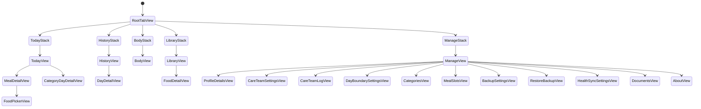

# Navigation and View Hierarchy (SwiftUI)

This document stores the 1:1 mapping between wireframes and SwiftUI views and the navigation state diagram. It is intended to be implementation oriented, not conceptual.

## Where this lives in the repo (best practice)

- Keep navigation and view hierarchy docs in `docs/architecture/` alongside other implementation-level design notes.
- Use Markdown plus Mermaid for diagrams so the docs render in GitHub and are easy to keep in sync.
- Link to this doc from `README.md` so new contributors can find it quickly.
- Update this doc alongside any UI or navigation change so it stays authoritative.
- For major navigation changes, add a short Architecture Decision Record (ADR) under `docs/architecture/decisions/` describing the why and tradeoffs.

## Assumptions and Scope

- iOS 17+
- SwiftUI + SQLite via DatabaseActor
- Tab-based navigation
- NavigationStack per tab (Apple best practice)
- Single-window app

## SwiftUI View Hierarchy (1:1)

### App Entry Point

```swift
@main
struct DragonHealthApp: App {
    var body: some Scene {
        WindowGroup {
            RootTabView()
        }
    }
}
```

### RootTabView

```swift
struct RootTabView: View {
    var body: some View {
        TabView {
            TodayStack()
                .tabItem { Label("Today", systemImage: "sun.max") }

            HistoryStack()
                .tabItem { Label("History", systemImage: "calendar") }

            BodyStack()
                .tabItem { Label("Body", systemImage: "figure") }

            LibraryStack()
                .tabItem { Label("Library", systemImage: "list.bullet") }

            ManageStack()
                .tabItem { Label("Manage", systemImage: "slider.horizontal.3") }
        }
    }
}
```

## Today Tab

### TodayStack

```swift
struct TodayStack: View {
    var body: some View {
        NavigationStack {
            TodayView()
        }
    }
}
```

### TodayView (Dashboard + Meals)

```swift
struct TodayView: View {
    var body: some View {
        ScrollView {
            VStack(spacing: 16) {
                DailySummaryView()
                MealListView()
            }
        }
        .navigationTitle("Today")
    }
}
```

Subviews
- DailySummaryView
- MealListView

### DailySummaryView

```swift
struct DailySummaryView: View {
    var body: some View {
        VStack {
            ForEach(categories) { category in
                NavigationLink {
                    CategoryDayDetailView(category: category, day: .today)
                } label: {
                    CategoryProgressRow(category: category)
                }
            }
        }
    }
}
```

### MealListView

```swift
struct MealListView: View {
    var body: some View {
        VStack {
            ForEach(mealSlots) { meal in
                NavigationLink {
                    MealDetailView(meal: meal)
                } label: {
                    MealRowView(meal: meal)
                }
            }
        }
    }
}
```

### MealDetailView (Primary Logging Screen)

```swift
struct MealDetailView: View {
    let meal: MealSlot

    var body: some View {
        List {
            ForEach(enabledCategories) { category in
                PortionStepperRow(meal: meal, category: category)
            }

            NavigationLink("Add from Library") {
                FoodPickerView(meal: meal)
            }
        }
        .navigationTitle(meal.name)
    }
}
```

### CategoryDayDetailView (Per-Category Entries for Day)

```swift
struct CategoryDayDetailView: View {
    let category: Category
    let day: DayLog
    @State private var quickAddPresented = false
    @State private var editingEntry: DayEntry?

    var body: some View {
        List {
            ForEach(day.entries(for: category)) { entry in
                DayEntryRow(entry: entry)
                    .swipeActions(edge: .trailing, allowsFullSwipe: true) {
                        Button(role: .destructive) {
                            // delete entry
                        } label: {
                            Label("Delete", systemImage: "trash")
                        }
                    }
                    .swipeActions(edge: .leading, allowsFullSwipe: false) {
                        Button {
                            editingEntry = entry
                        } label: {
                            Label("Edit", systemImage: "pencil")
                        }
                        .tint(.blue)
                    }
            }
        }
        .navigationTitle(category.name)
        .toolbar {
            Button {
                quickAddPresented = true
            } label: {
                Image(systemName: "plus")
            }
        }
        .sheet(item: $editingEntry) { entry in
            // edit sheet with entry prefilled
        }
        .sheet(isPresented: $quickAddPresented) {
            // Quick Add with day + category prefilled
        }
    }
}
```

Notes:
- DayEntryRow uses leading/trailing swipe actions for edit and delete.

## History Tab

### HistoryStack

```swift
struct HistoryStack: View {
    var body: some View {
        NavigationStack {
            HistoryView()
        }
    }
}
```

### HistoryView (Calendar + Trends Toggle)

```swift
struct HistoryView: View {
    @State private var mode: HistoryMode = .calendar

    var body: some View {
        VStack {
            HistoryModePicker(mode: $mode)

            switch mode {
            case .calendar:
                CalendarHeatmapView()
            case .trends:
                AdherenceTrendsView()
            }
        }
        .navigationTitle("History")
    }
}
```

### DayDetailView

```swift
struct DayDetailView: View {
    let day: DayLog

    var body: some View {
        List {
            ForEach(day.categorySummaries) { summary in
                CategoryDaySummaryRow(summary: summary)
            }

            Section("Meals") {
                ForEach(day.meals) { meal in
                    MealSummaryRow(meal: meal)
                }
            }
        }
        .navigationTitle(day.formattedDate)
    }
}
```

## Body Tab

### BodyStack

```swift
struct BodyStack: View {
    var body: some View {
        NavigationStack {
            BodyView()
        }
    }
}
```

### BodyView

```swift
struct BodyView: View {
    var body: some View {
        ScrollView {
            VStack(spacing: 16) {
                BodyMetricInputView()
                BodyTrendChartsView()
            }
        }
        .navigationTitle("Body")
    }
}
```

## Library Tab

### LibraryStack

```swift
struct LibraryStack: View {
    var body: some View {
        NavigationStack {
            LibraryView()
        }
    }
}
```

### LibraryView

```swift
struct LibraryView: View {
    var body: some View {
        List {
            ForEach(foodItems) { item in
                NavigationLink {
                    FoodDetailView(food: item)
                } label: {
                    FoodRowView(food: item)
                }
            }
        }
        .navigationTitle("Library")
    }
}
```

### FoodDetailView

```swift
struct FoodDetailView: View {
    let food: FoodItem

    var body: some View {
        Form {
            FoodPortionMappingView(food: food)
            Button("Add to Meal") {
                // meal picker
            }
        }
        .navigationTitle(food.name)
    }
}
```

## Manage Tab

### ManageStack

```swift
struct ManageStack: View {
    var body: some View {
        NavigationStack {
            ManageView()
        }
    }
}
```

### ManageView

```swift
struct ManageView: View {
    var body: some View {
        Form {
            Section("Profile & Care Team") {
                NavigationLink("Profile Details") {
                    ProfileDetailsView()
                }
                NavigationLink("Care Team") {
                    CareTeamSettingsView()
                }
                NavigationLink("Meeting Log") {
                    CareTeamLogView()
                }
            }

            Section("Plan & Meals") {
                NavigationLink("Day Boundary") {
                    DayBoundarySettingsView()
                }
                NavigationLink("Categories") {
                    CategoriesView()
                }
                NavigationLink("Meal Slots") {
                    MealSlotsView()
                }
            }

            Section("Data & Backup") {
                NavigationLink("iCloud Backup") {
                    BackupSettingsView()
                }
                NavigationLink("Restore Backup") {
                    RestoreBackupView()
                }
            }

            Section("Integrations") {
                NavigationLink("Apple Health") {
                    HealthSyncSettingsView()
                }
            }

            Section("Documents") {
                NavigationLink("Document Library") {
                    DocumentsView()
                }
            }

            Section("About") {
                NavigationLink("Privacy & Version") {
                    AboutView()
                }
            }
        }
        .navigationTitle("Manage")
    }
}
```

## Navigation State Diagram



## Architectural Notes (Important)

- One NavigationStack per tab preserves state when switching tabs.
- NavigationLink only inside stacks.
- Avoid modals except for:
  - date picker
  - export confirmation
- Use DatabaseActor access through view models for persistence.

## Next High-Value Artifacts

If you want to continue in a build-ready way, the natural next steps are:
1. SQLite schema (tables + relationships)
2. Portion calculation engine
3. Adherence evaluation service
4. Preview mocks for each SwiftUI view
